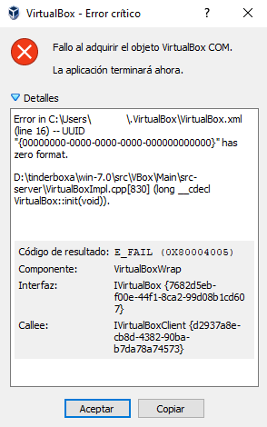

## Error installing VirtualBox on Windows

> Microsoft Visual C++ Redistributable Package required

There are 2 steps to solve this error:

1. Install [Microsoft Visual C++ Redistributable Package](https://learn.microsoft.com/es-es/cpp/windows/latest-supported-vc-redist?view=msvc-170).

2. Run the installer as Administrator: Right-click on the installer and select the option "Run as administrator".

## Problem with product key in unattended Windows installation

Windows product key error](../static/img/win-product-key-error.png)

This error appears when a product key is not specified during the unattended installation setup process. To correct this, it is recommended to reconfigure the virtual machine and place the following key in the "Product Key" field

> VK7JG-NPHTM-C97JM-9MPGT-3V66T

This key is only valid for the installation process, but not for activating Windows.

## Error after installation "Failed to acquire VirtualBox COM object".

This error may occur due to some error in the process after the installation of VirtualBox, which prevents the program from starting for the first time.

It occurs due to the occurrence of an error in the VirtualBox configuration files. To solve it we must force the program to generate these files again, to do this you must go to the user's personal folder `C:\Users\{Username}` and there locate the folder `.VirtualBox`. It is enough to change the name of this folder (it can be .VirtualBox_old) and to start the program again so that the configuration files are generated again. 

If for some reason you had a virtual machine already created and it does not appear in the program, do not worry. The virtual units are in the folder you renamed, you only have to add the machines again and specify the virtual hard disk of your old machine and you will have it available again.